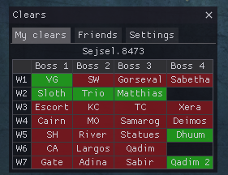

# Introduction
**arcdps clears** is an addon for arcdps that shows raid clears within the game.

This guide shows how to install and use the addon.

## Webpage
The addon has a [webpage](https://gw2scratch.com/tools/arcdps-clears), where you may also download it.

## Contributing
The source code is available on GitHub: [this guide](https://github.com/gw2scratch/arcdps-clears-guide/), [arcdps clears](https://github.com/gw2scratch/arcdps-clears/). You may also report issues and feature requests there in the respective repositories. Pull requests are also welcome.

## License
Both this guide and arcdps clears is licensed under the MIT license.
