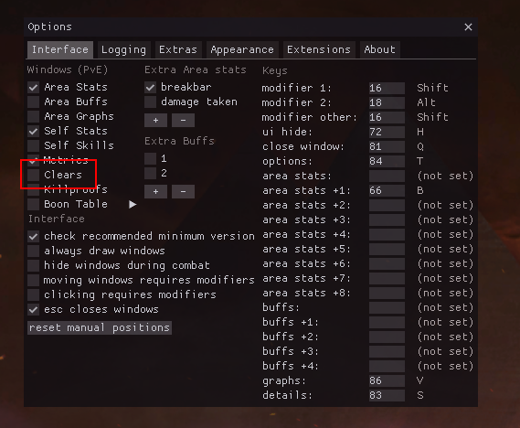
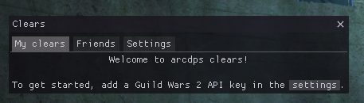
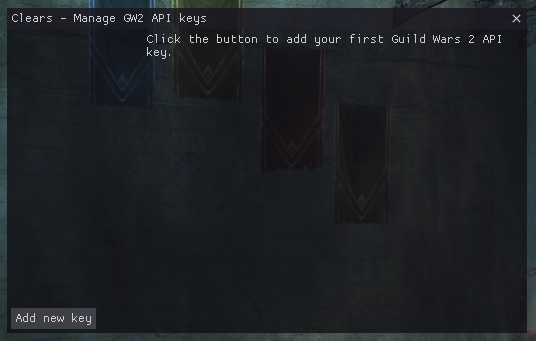
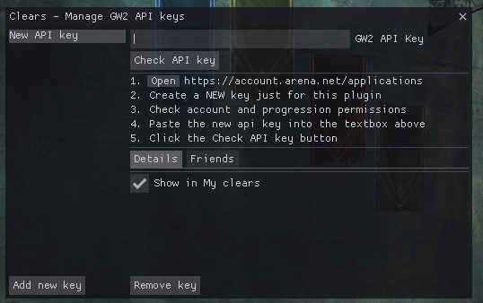
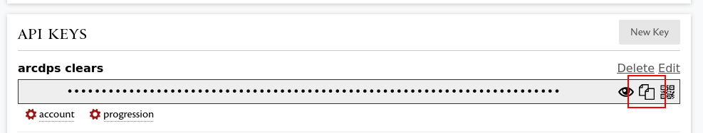
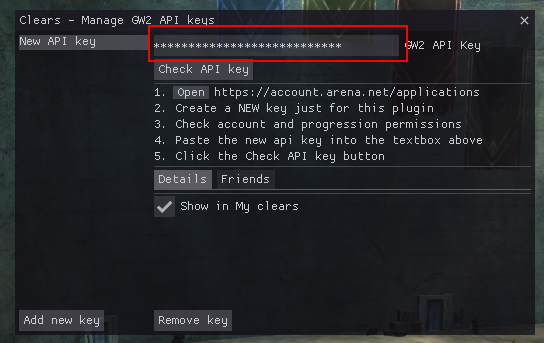
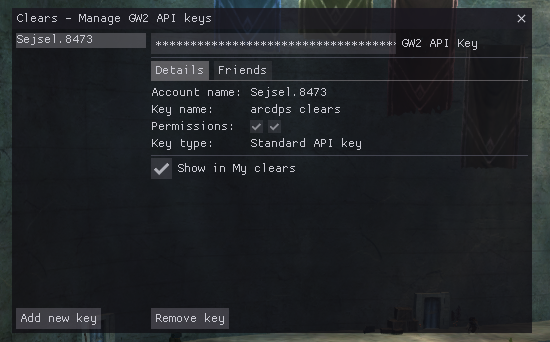

# Adding an API key

## Opening the Clears window

To get started, open the Clears window. Open the arcdps settings (`Shift+Alt+T`
by default) and click the checkbox to open the Clears window.

Alternatively, you can use the [keybind](./keybinds.md) to open the window (`Shift+Alt+C` by default).

## The Clears window

The clears window should now appear and prompt you to add an API key. To
continue, click the settings button to open the API key settings.

You can also access the API key settings by going to the `Settings` tab and
clicking the `Manage GW2 API keys` button.

## The API key management window

The API key management window will look like this when there are no API keys added yet:

To continue, click the `Add new key` button.

## Adding the API key

1. Copy your [**new** key](./api-key-creation.md) into your clipboard by using the copy icon:

2. Paste the key into the `GW2 API Key` textbox:

3. Click the `Check API key` button.

If everything went right, the window should now list your account name:

If there were any issues, the window will tell you what went wrong.

## Adding more keys
If you have multiple accounts, you can add multiple keys here. If you want to
see clears of your friends, check out [Friends](../friends/how-to.md) instead.

## Next step
Now that your API key is added, you may [check your clears](./clears.md).
