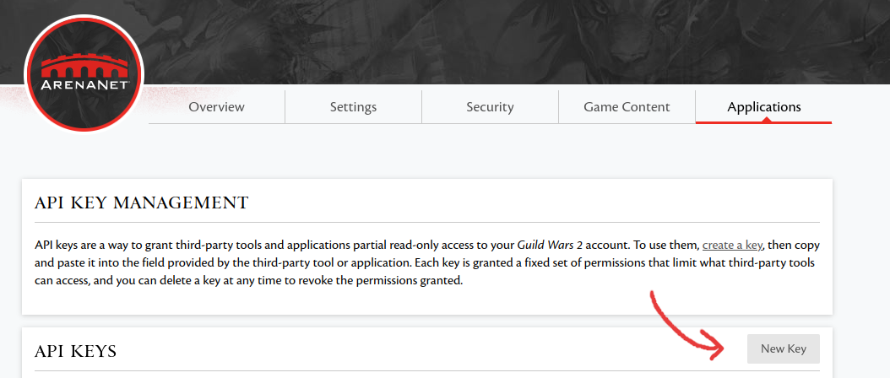
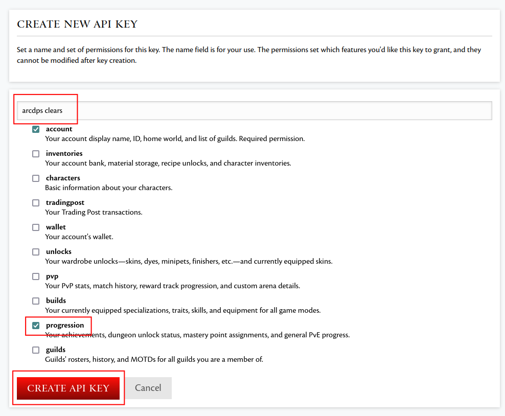

# Creating an API key
In this step, you should create a **new** API key. Do not reuse a key from
another application. Really, do create a new one.

1. Go to [https://account.arena.net/applications](https://account.arena.net/applications) and log in.
2. Create a **new** API key with the progression permission:

---

3. Copy the new key into your clipboard by using the copy icon:

## Next step
Now that you have a new API key, you can [add it to the addon](./api-key-adding.md).
