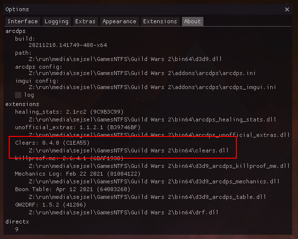

# Installation

## Requirements
You may need to install the latest Visual C++ redistributable ([download from Microsoft](https://aka.ms/vs/17/release/vc_redist.x64.exe), [article](https://docs.microsoft.com/en-us/cpp/windows/latest-supported-vc-redist)).

## Manual installation (dll files)

arcdps clears is an addon for [arcdps](https://www.deltaconnected.com/arcdps/),
and as such, requires arcdps to run. This guide assumes that you already have
arcdps installed.

0. Install arcdps.
1. [Download](https://gw2scratch.com/tools/arcdps-clears) the latest version of the clears addon.
1. Place `arcdps_clears.dll` into `Guild Wars 2/bin64` (should be the same directory as other arcdps addons).

## Using the Mod Manager (UOAOM)

0. Get the Unofficial Addon Manager ([installation guide](https://github.com/gw2-addon-loader/GW2-Addon-Manager/wiki)).
1. Run the Addon Manager.
1. Select both arcdps and arcdps clears.
1. Install.

## Verifying the installation

If everything worked correctly, you should be able to see the `Clears` window in the arcdps settings. The default key combination to open these settings is `Shift+Alt+T`.

You can also check the exact version that is loaded in the `About` tab:

## Next step
To get started with the addon, read [Adding an API key](./api-keys.md).
