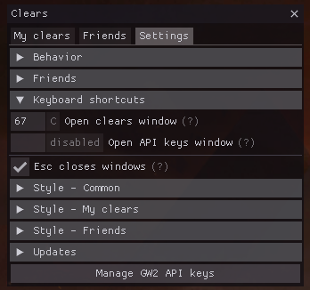

# Keybinds
The addon provides keybinds that make it easier to open its windows.
The used modifiers are the same as for arcdps (Shift+Alt by default).

The keybinds are:
- open Clears window (Shift+Alt+C by default)
- open API keys window (disabled by default)

## Changing keybinds
To change keybinds, go to the addon settings. The keybinds are located in the
`Keyboard shortcuts` collapsible section.

The keybinds use [virtual key codes](./key-codes.md). If you input a number, you can also see the
corresponding key name to the right of the textbox. These names may be affected
by your keyboard layout, you may need to do a bit of experimentation.

Common key codes are listed [here](./key-codes.md).

## Default area stats keybind in arcdps (C)
The C keybind has a collision with arcdps itself; it uses Shift+Alt+C to open
the area stats window by default. This keybind is seldom used and C makes
perfect sense for clears. If you desire to restore the original keybind for
arcdps, change the keybind in clears as it has priority.
